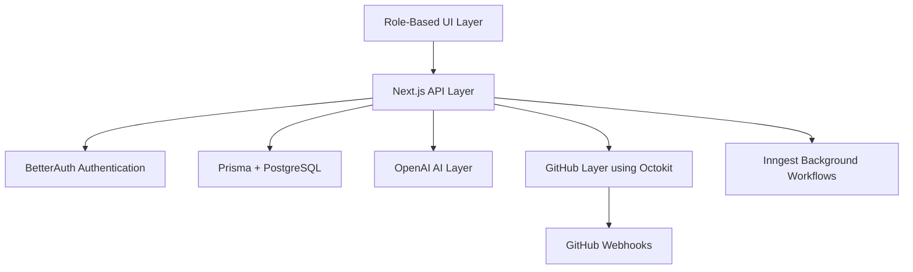

# Loom

**Loom** is an AI-powered product delivery platform for software teams. It manages the full journey from a raw client request to a production-ready feature through AI-assisted product thinking, PRD generation, developer task planning, GitHub pull request review, fix loops, and final human approval.

---

<br />

## Why the name “Loom”?

A loom is a tool used to weave threads together into a complete fabric.

This project uses the same idea for software delivery. In real product teams, work is usually scattered across client messages, support requests, product notes, PRDs, developer tasks, GitHub pull requests, code reviews, and approvals. Loom brings all of those separate threads together and weaves them into one clear delivery workflow.

---

<br />

# Project Overview

Loom is a production-grade enterprise SaaS platform built for existing software teams.

It is not just a task manager, a PRD generator, or an AI chatbot. Loom manages the complete lifecycle of software delivery.

It helps teams handle:

* feature requests
* change requests
* bug reports
* UI improvements
* backend updates
* optimization work
* GitHub pull request reviews
* developer fix loops
* senior engineer approvals

The main problem Loom solves is that software requests often arrive in an unclear and unstructured way. Clients may ask for something without enough context, Product Managers may need to rewrite requirements, developers may receive vague tasks, and reviewers may not know whether the final implementation actually satisfies the original request.

Loom solves this by using AI across the workflow while keeping humans in control of final decisions.

---

<br />


# Core Workflow

```txt
Client Request
        ↓
AI Discovery
        ↓
Client-facing PRD
        ↓
Product Manager Review
        ↓
Final PRD
        ↓
AI Development Task Planning
        ↓
Developer Implementation
        ↓
GitHub Pull Request
        ↓
AI Code Review
        ↓
Fix Required / AI Approved
        ↓
Senior Engineer Human Approval
        ↓
Shipped
```

---

<br />

# Role-Based Portals

Loom has separate portals for each role. Every role has a focused responsibility in the product delivery lifecycle.

---

<br />

## 1. Admin Portal

The Admin manages the workspace, projects, repositories, members, roles, and billing.

### Admin can:

* create projects
* connect GitHub repositories
* invite users by link
* assign user roles
* assign users to specific projects
* view project members
* preview role-specific portals
* manage workspace settings
* view billing section


<br />

## 2. Client Portal

The Client creates product requests in simple language.

The Client does not need to write a perfect PRD. Loom AI helps understand the request, checks missing details, and turns it into a structured requirement.

### Client can:

* select request type
* describe the change they need
* run AI Discovery
* review AI-generated analysis
* submit request
* add additional information
* generate PRD
* send PRD to Product Manager

### Supported request types:

* Feature request
* Change request
* Bug request
* Improvement request
* New product request


### AI Discovery Example

```txt
This is a UI/branding change.

Likely affected area:
Landing page, header, or branding component.


<br />

## 3. Product Manager Portal

The Product Manager reviews client-generated PRDs and prepares them for engineering.
The PM is responsible for finalizing the requirement before it reaches the developer.

### Product Manager can:

* view PRDs sent by clients
* open a specific PRD
* review AI-generated PRD content
* edit PRD details
* add missing product decisions
* save changes permanently
* finalize the PRD
* send finalized PRD to AI task planning
* review AI-generated developer responsibilities
* send approved task cards to developer portal

Final PRD
        ↓
AI analyzes finalized PRD
        ↓
AI creates role-specific development task cards
        ↓
PM reviews generated task cards
        ↓
PM sends tasks to Developer Portal
```


AI task planning output:

```txt
Task for: UI Designer

Prepare logo update for landing page

Work items:
- Review current logo usage.
- Prepare updated logo direction according to the PRD.
- Make sure the logo fits the dark theme.
- Define correct size, spacing, placement, and responsive behavior.
```


<br />

## 4. Developer Portal

The Developer receives PM-approved AI-generated task cards.

The Developer implements the task inside the connected GitHub repository and creates a real pull request.

### Developer can:

* view assigned tasks
* read task summary
* understand work items
* see likely affected files
* implement the task in GitHub
* create or link a real GitHub pull request
* run AI review against the PR
* see AI review results
* fix blocking issues
* rerun AI review after fixes
* move work forward when AI approves

After implementation, the Developer links a real GitHub pull request.

Example:

```txt
https://github.com/owner/repo/pull/12
```

Then Loom fetches the real PR data and runs AI review.

---

<br />

## 5. Senior Engineer / Human Reviewer Portal

The Senior Engineer is the final human approver.
AI can assist, but final approval remains with a human technical reviewer.

### Senior Engineer can:

* review AI-approved pull requests
* compare implementation with final PRD
* inspect AI review results
* check changed files
* verify blocking issues are resolved
* approve implementation
* reject implementation
* request more changes
* mark the feature complete


<br />

# Tech Stack

## Frontend

* Next.js App Router
* TypeScript
* Tailwind CSS
* Shadcn-style UI
* Dark SaaS interface
* Orange accent color: `#aa4825`

## Backend

* Next.js API routes
* tRPC monorepo structure
* BetterAuth
* Prisma ORM
* PostgreSQL / Neon
* Audit log based workflow tracking

## AI

* OpenAI API
* AI request analysis
* AI PRD generation
* AI task planning
* AI GitHub PR review

## GitHub

* Octokit
* GitHub repository connection
* Pull request fetching
* Changed file fetching
* Diff analysis
* GitHub webhook support
* AI review comments on PRs

## Async Workflow

* Inngest planned for background jobs
* GitHub webhook processing
* AI review queue
* re-review loop
* notification workflows

## Billing

* Razorpay planned

## Deployment

* Vercel planned

---

<br />

# Architecture

```txt
apps/
  web/
    src/
      app/
        admin/
        client/
        pm/
        dev/
        review/
        api/
          client/
          pm/
          developer/
          github/
          invites/
      components/
      lib/

packages/
  db/
  trpc/
  ai/
  github/
  inngest/
```

---

<br />

## Application Layers



---

<br />

## UI Layer

Role-based portals:

```txt
/admin
/client/dashboard
/pm
/dev
/review
```

Each role has its own focused workflow and project-restricted access.

---

<br />

## API Layer

Main API route groups:

```txt
/api/client/*
/api/pm/*
/api/developer/*
/api/github/*
/api/invites/*
```

These routes handle:

* request creation
* PRD saving
* PRD finalization
* AI task generation
* sending tasks to developers
* GitHub PR review
* GitHub webhook logging
* invite acceptance

---

<br />

## Database Layer

Prisma and PostgreSQL store:

* users
* workspaces
* memberships
* projects
* GitHub repositories
* invites
* client project access
* feature requests
* PRD states
* development task batches
* GitHub PR review results
* audit events

---

<br />

## AI Layer

AI is used for:

* request clarification
* duplicate or existing feature detection
* PRD generation
* PM task planning
* developer role assignment
* real GitHub PR review

---

<br />

## GitHub Layer

GitHub integration uses Octokit to:

* connect repositories
* verify repository ownership
* fetch pull requests
* fetch changed files
* fetch patches/diffs
* post AI review comments
* track review status

---

<br />

# Setup Instructions

## 1. Clone the repository

```bash
git clone <your-repository-url>
cd shipflow
```


---

##  Setup environment variables

Create a `.env` or `.env.local` file.

```env
DATABASE_URL=
DIRECT_URL=

BETTER_AUTH_SECRET=
BETTER_AUTH_URL=http://localhost:3000

NEXT_PUBLIC_APP_URL=http://localhost:3000

OPENAI_API_KEY=
OPENAI_MODEL=gpt-4o-mini

GITHUB_TOKEN=
GITHUB_WEBHOOK_SECRET=

RAZORPAY_KEY_ID=
RAZORPAY_KEY_SECRET=
```

---

##  Setup database

Generate Prisma client:

```bash
pnpm prisma generate
```

Run migrations:

```bash
pnpm prisma migrate dev
```

Or push schema during development:

```bash
pnpm prisma db push
```

---

## 5. Start development server

```bash
pnpm dev
```

Open:

```txt
http://localhost:3000
```

---

<br />

# Environment Variables

## Database

```env
DATABASE_URL=
DIRECT_URL=
```

Used by Prisma to connect to PostgreSQL / Neon.

---

## BetterAuth

```env
BETTER_AUTH_SECRET=
BETTER_AUTH_URL=
```

Used for authentication, sessions, sign-in, invite login, and role-based redirects.

---

## App URL

```env
NEXT_PUBLIC_APP_URL=http://localhost:3000
```

Used for redirects, invite links, and public app references.

---

## OpenAI

```env
OPENAI_API_KEY=
OPENAI_MODEL=gpt-4o-mini
```

Used for:

* request analysis
* PRD generation
* task generation
* GitHub PR review

---

## GitHub

```env
GITHUB_TOKEN=
GITHUB_WEBHOOK_SECRET=
```

`GITHUB_TOKEN` is used by Octokit to fetch pull requests, changed files, patches, and post comments.

`GITHUB_WEBHOOK_SECRET` is a random secret created by the developer.

Generate one:

```bash
node -e "console.log(require('crypto').randomBytes(32).toString('hex'))"
```

Use the same value in:

```txt
.env file
GitHub repository webhook settings
```

---

## Razorpay

```env
RAZORPAY_KEY_ID=
RAZORPAY_KEY_SECRET=
```

Used later for paid plans, billing, AI credits, and usage limits.

---

<br />

# Database Schema Notes

The database is managed using Prisma.

---

## User

Stores application users.

Important fields:

```txt
id
name
email
createdAt
```

Users get role-based access through memberships and project access records.

---

## Workspace

Represents an organization or team workspace.

Important fields:

```txt
id
name
slug
createdAt
```

---


---


Github - Example:

```txt
vaishnavi/skillhire
```


##  Pull Request Review Flow

Developer enters a real GitHub PR URL:

```txt
https://github.com/owner/repo/pull/12
```

or:

```txt
owner/repo#12
```

Loom then:

```txt
1. Validates developer access
2. Verifies PR repository matches connected project repository
3. Fetches PR metadata using Octokit
4. Fetches changed files and patches
5. Loads PM-approved PRD and tasks
6. Sends diff + PRD + tasks to AI
7. Stores AI review result
8. Posts review comment to GitHub
9. Shows result in Developer Portal
```

---


## Why Inngest is useful

AI and GitHub operations can be slow, retry-heavy, or event-driven.

Examples:

* AI request analysis
* PRD generation
* task generation
* GitHub PR diff fetching
* AI code review
* webhook processing
* re-review loop
* notifications
* human approval reminders

These should not always block the user interface.

---


##  AI Follow-Up Questions

If the request is unclear, AI asks follow-up questions.

Example:

```txt
Request:
Add images to homepage.
```

AI asks:

```txt
- Which homepage section should contain the images?
- How many images should be added?
- Should these images be static or dynamic?
- Should the layout change on mobile?
```

---


## AI Product Manager Support

AI helps the PM by:

* improving unclear PRDs
* identifying missing details
* converting product scope into engineering-ready work
* creating developer responsibility cards
* assigning tasks to the correct role

---


##  AI GitHub Pull Request Review

AI reviews real GitHub PR changes.

It receives:

* final PRD
* assigned task details
* changed files
* patches/diffs
* PR metadata

It returns:

```txt
FIX_REQUIRED
```

or:

```txt
AI_APPROVED
```

Example issue:

```txt
Issue:
The PR updates the desktop layout but does not handle mobile responsiveness.

Recommendation:
Add responsive behavior for mobile screen sizes.
```

---

## AI Fix Loop

The developer can fix the PR and rerun AI review.

```txt
AI Review
        ↓
Fix Required
        ↓
Developer fixes code
        ↓
AI Review again
        ↓
AI Approved
        ↓
Human Review
```

---

<br />


# Current Project Status

Completed or partially completed:

* Admin project management
* Role-based invite flow
* Client request creation
* Client AI Discovery
* Client PRD generation
* Client additional information
* Client sends PRD to PM
* PM project-restricted dashboard
* PM PRD review
* PM editable PRD
* PM final PRD
* AI task generation inside PM portal
* Developer responsibility page
* Task grouping by developer role
* Send task to developer
* Persist tasks after reload
* Developer task display
* GitHub PR review backend route planned/created
* GitHub webhook route planned/created

---

# Author

Built by **Vaishnavi Rajput**.
